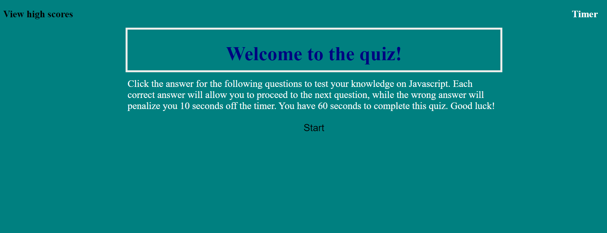

# Code-Quiz

# Description
This quiz was created to test the knowledge of Javascript fundamentals. Each of the 5 questions is multiple choice. The user has a total of 60 seconds to finish the quiz and any wrong answers will deduct 10 seconds each from the overall time. At the end, the user will enter initials for their high score to be entered in the high score list. 

# Images 

# Links
 https://jgrossh2.github.io/Code-Quiz/.

# Technologies used
 *HTML  
 *CSS  
 *Javascript

 # Contributions
 Created by Joanna Grosshans, any questions please contact <joannagrosshans2@gmail.com>
